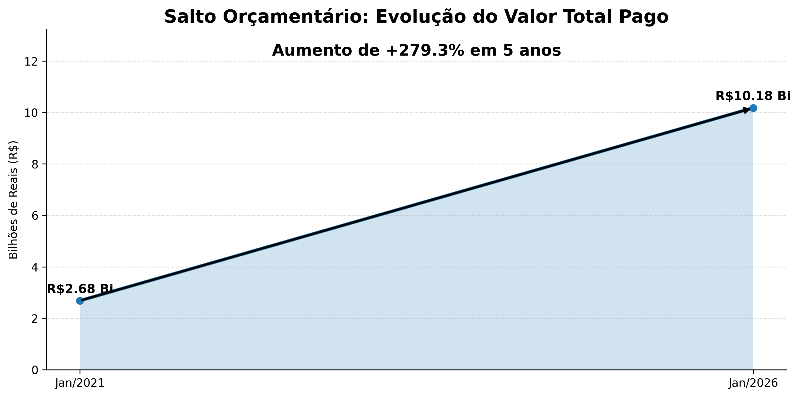
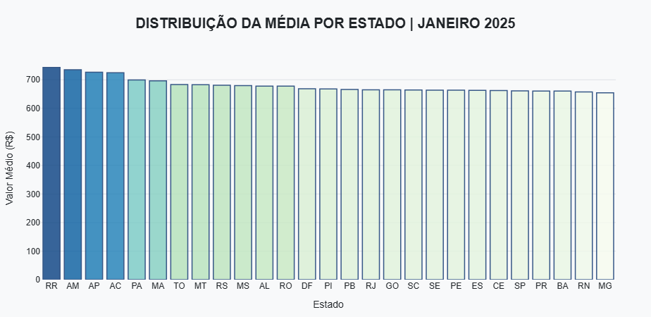
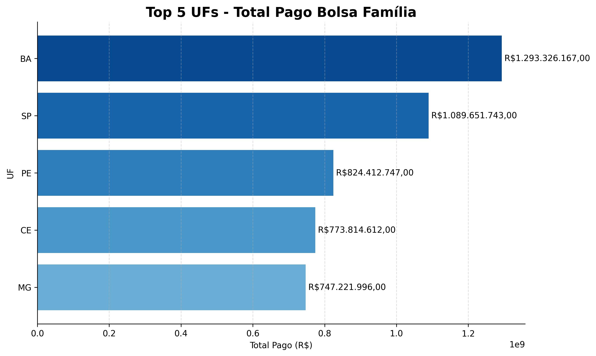
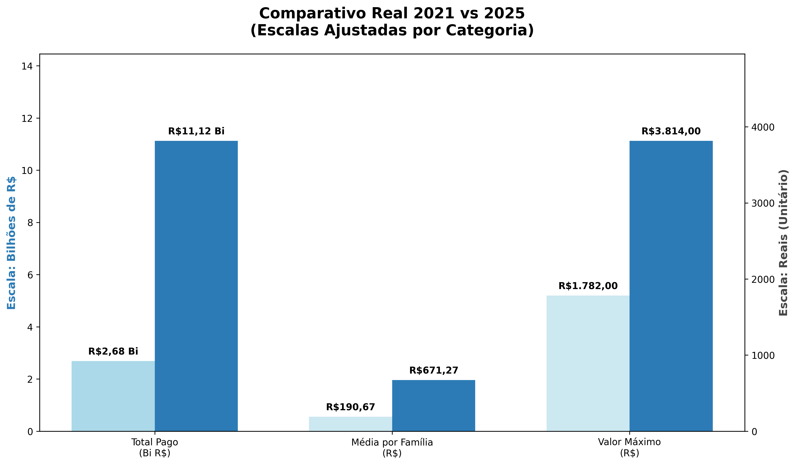

  <h1>Grupo 3</h1>

  
Bolsa Familia 2025

# 📊 Análise de Dados - Bolsa Família 2025 com PySpark

## 📌 O que é o Programa Bolsa Família?

O **Bolsa Família** é o maior programa de transferência direta de renda do Brasil, focado em famílias em situação de vulnerabilidade. Em 2025, o programa consolidou um modelo de renda variável, onde o valor do benefício é ajustado conforme a composição familiar (nutrizes, gestantes, crianças e adolescentes), garantindo maior equidade e justiça social.

---

## 📝 Sobre o Projeto

Este projeto utiliza o ecossistema **Apache Spark** para processar e analisar grandes volumes de dados (*Big Data*) provenientes do Portal da Transparência.  

O foco principal é a **comparação entre os cenários de 2021 e 2025**, mensurando:

- O impacto do salto orçamentário  

- A eficiência da distribuição de renda nas diferentes regiões do país  
---

## 📁 Estrutura do Projeto

📦 BOLSA FAMILIA 2025\

├── 📂 dados\
│   └── 📄 NovoBolsaFamilia25.csv\
├── 📂 notebooks\
│   ├── 📄 analise_exploratoria.ipynb\
│   ├── 🖼️ comparativo_2021X2025.png\
│   ├── 🖼️ salto_orcamentario.png\
│   └── 🖼️ top_ufs_bolsa_familia.png\
├── 📂 src\
│   ├── 📄 analises.py\
│   ├── 📄 graficos.py\
│   ├── 📄 leitura_dados.py\
│   └── 📄 tratamento_dados.py\
├── 📂 venv\
├── 📄 .gitignore\
├── 📄 README.md\
└── 📄 requirements.txt

---

## 🚀 Tecnologias Utilizadas

  
  
  
  
  
  

  🐍 Python &nbsp;&nbsp;
  ⚡ PySpark &nbsp;&nbsp;
  🔢 NumPy &nbsp;&nbsp;
  📊 Matplotlib &nbsp;&nbsp;
  🌐 Plotly &nbsp;&nbsp;
  🧾 Pandas

## 🛠️ Como Executar

1. **Clone o repositório:**
   `git clone https://github.com/larissalucasefg-web/Projeto-Bolsa-Familia-2025.git`

2. **Instale as dependências:**
   `pip install -r requirements.txt`

3. **Pré-requisitos:**
   Certifique-se de ter o **Java 17 ou superior** instalado (necessário para o PySpark).

4. **Execução:**
   - Para ver a análise interativa: abra o arquivo em `notebooks/`.
   - Para rodar o pipeline via script: `python src/analises.py`.
   - Para rodar o pipeline via script: `python src/analises.py`.

## 📋 Funcionalidades do Pipeline

### 1. ⚙️ Configuração Big Data

O ambiente é otimizado para lidar com arquivos massivos utilizando uma SparkSession configurada com 8GB de RAM e ajuste de partições de shuffle para máxima performance de CPU.

### 2. 🔄 Processo de ETL (Extract, Transform, Load)

Padronização: Renomeação de colunas complexas para o formato snake_case.

Casting: Conversão de valores monetários brasileiros (ponto e vírgula) para o tipo Decimal(10,2).

Enriquecimento: Extração de metadados temporais (Ano/Mês) para análises de tendência.

### 3. 📊 Insights Gerados

- Ticket Médio: Evolução do valor por família (R$ 190,67 em 2021 vs. R$ 671,27 em 2025).

- Salto Orçamentário: Identificação de um crescimento de +314% no investimento total.

- Equidade Social: Análise da amplitude de pagamentos, demonstrando que o novo modelo atende melhor famílias numerosas.

- Top 5 Estados por Investimento
Ranking das Unidades Federativas com maior volume de repasses.

## 🛠️ Como Executar e Visualizar os Gráficos
Para reproduzir as análises e visualizar os resultados em sua máquina local, siga os passos abaixo:

1. Pré-requisitos
Como o projeto utiliza Apache Spark, é necessário ter instalado:

Java 17 ou superior (com a variável JAVA_HOME configurada).
Python 3.x.

### 3. Gerando os Resultados
Você pode interagir com o projeto de duas formas:

Via Script (Automação): Para processar os dados e gerar os arquivos de imagem dos gráficos automaticamente na pasta notebooks/, execute:

`python src/graficos.py`

Via Jupyter Notebook (Exploração):
Para uma visualização rica e detalhada, abra o arquivo notebooks/analise_exploratoria.ipynb. Lá, os gráficos são renderizados de forma interativa utilizando Plotly e Matplotlib.

## 📊 Gráficos Gerados

| Salto Orçamentário | Distribuição por Estado |
| :---: | :---: |
|  |  |
| **Top UFs** | **Comparativo 2021x2025** |
|  |  |

### 📈 Exemplo de Resultado

O projeto gera automaticamente o gráfico de Salto Orçamentário, que compara visualmente o faturamento total entre os anos analisados, utilizando setas indicativas e rótulos de porcentagem calculados em tempo real pelo script.

## 🎯 Finalidade

Este repositório foi desenvolvido para fins de estudo e aplicação prática em:

Engenharia de Dados com foco em Spark

Análise de Políticas Públicas e Impacto Social

## 👩‍💻 Autores

Projeto desenvolvido por:

Bruno, Leandro, Emmily, Larissa e Jhulyana